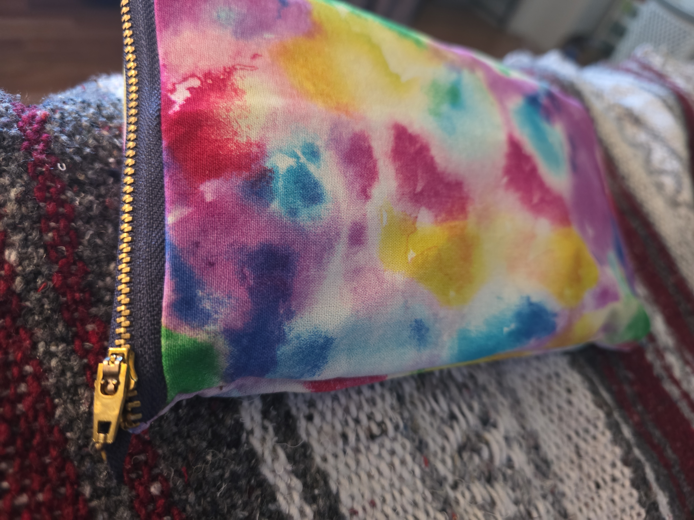
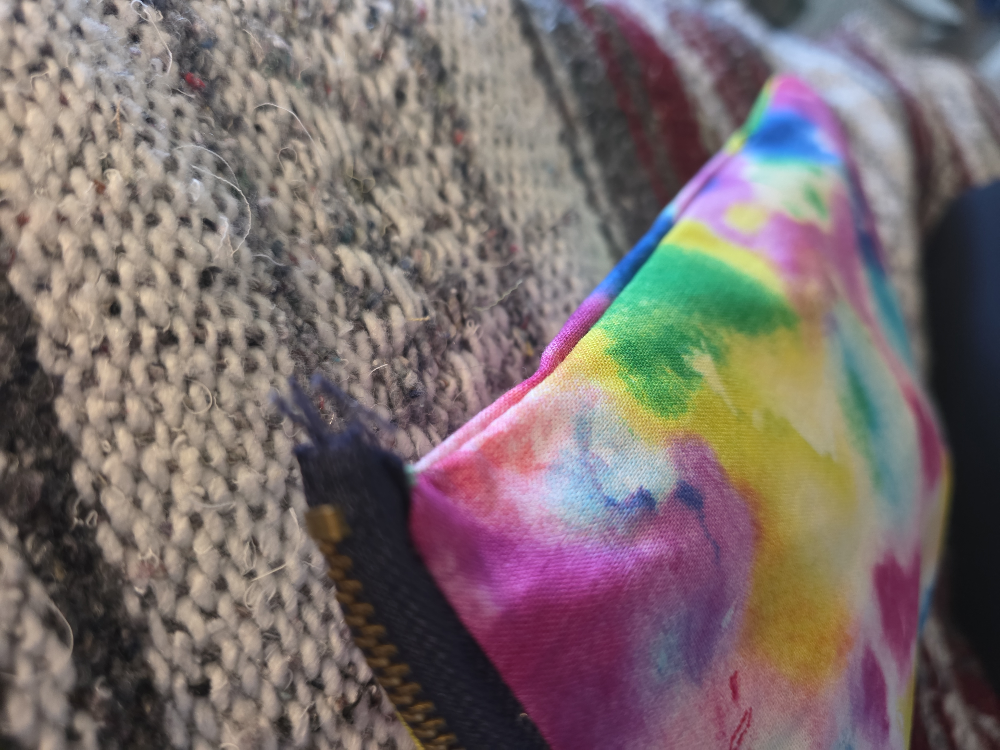

# Prototype 1
## A remembering-how-to-sew project

The ultimate goal of this project is to build a utility belt for my jeans pocket, such that:

1. All the things I like to carry fit mostly in one pocket.

2. They remain stacked top-to-bottom of the pocket, so there's no bulging or weird tangles.

3. Ideally, each item is separately accessible by feel, so i can always pull the right thing out without looking.

For my first attempt, I sewed this monstrosity:

As you can see, just about everything you can do wrong, I did wrong.  Here are my quick lessons:

* Zippers won't work. They're bulky and require removing the pouch from the pocket.

* Anything I have to reach into will not work, since pockets are typically already tight.

* There's an optimal shape, which probably isn't rectangular.

* I need to practice some seams with scraps; I'm very uneven, since I've probably lost some muscle memory.

For my next attempt, I'm thinking about a solid piece of slightly stiffened fabric (think interface) with pockets on the outside, arranged uniquely -- or with tactile cues -- so I know what my fingers are touching.
